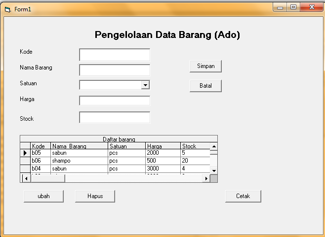
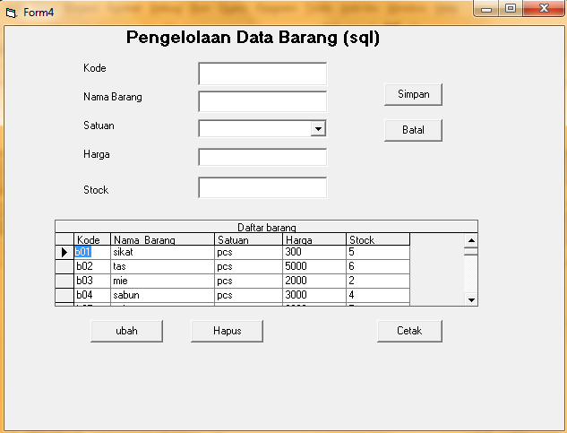
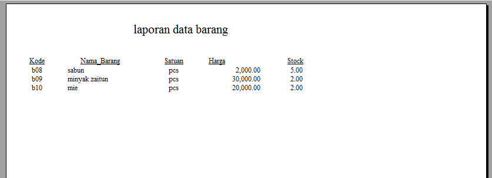
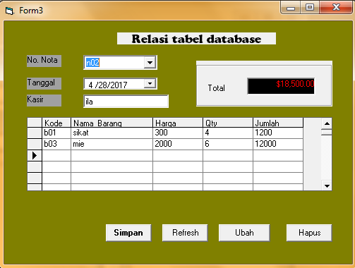
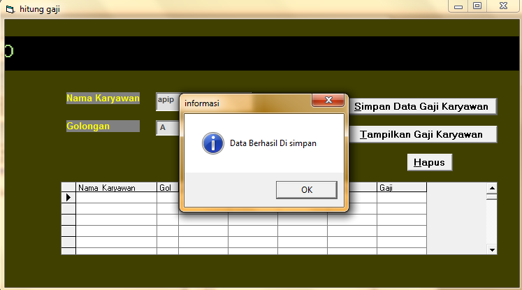
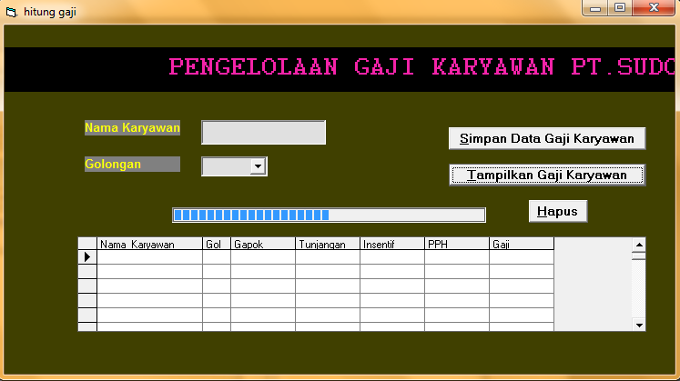
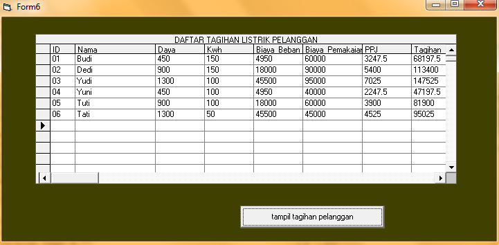

# sistem-CRUD-dan-koneksi-ke-database
melihat,menyimpan,mengubah dan menghapus data yang sudah terkoneksi dengan database (acces).

tampilan aplikasi untuk mengolah data :  

tampilan report/laporannya :  

tampilan untuk memproses relasi tabel :  

tampilan untuk mengolah data gaji karyawan :  
1. simpan data  

2. tampilkan data  

menampilkan database yang sudah terknoneksi dengan mc.acces :   

